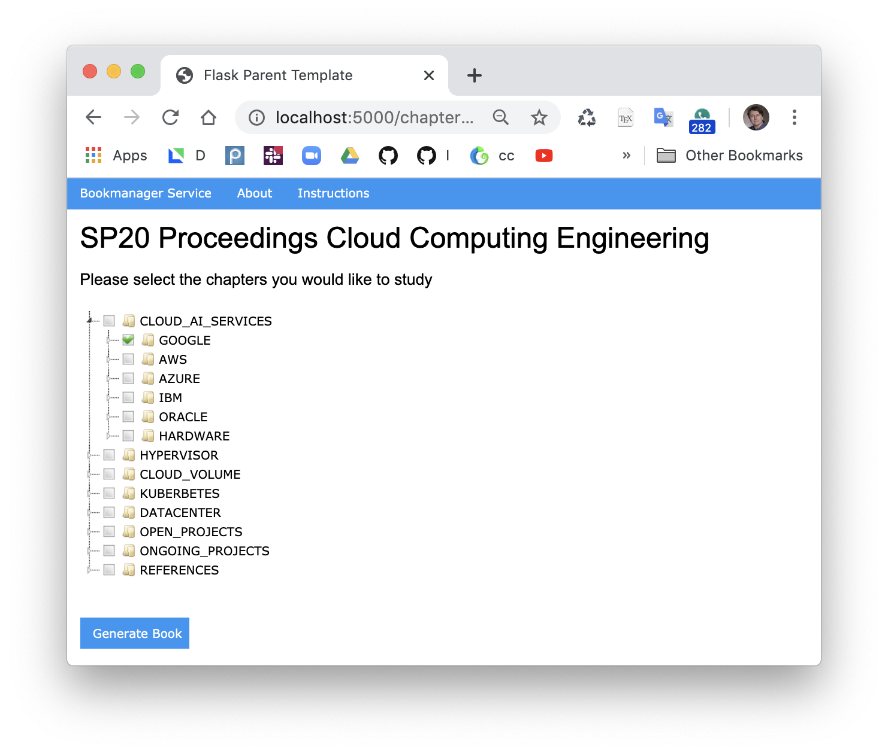

# bookmanager-service

This service provides a cloud-based online bookmanager for
individualized learning material managed via cyberaide bookmanager yaml files

Cyeraide bookamanger code is available from 

* <https://pypi.org/project/cyberaide-bookmanager/>

Cyberaide bookmanager that can create books based on markdown files that
are distributed online in github. The table of content is managed
through a YAML file. Cyberaide bookmanager-service can read these yaml
files and present a graphical user interface that allows us to check on
specific sections and change the order through a convenient tree view.
  


## Installation

We assume you have docker installed: 

```bash
mkdir cm
cd cm
pip install cyberaide-bookmanager
https://github.com/cyberaide/bookmanager-service.git
cd bookmanager-service
make image
bookmanager-service
```

In your web browser open 

```
localhost:5000
```

Make sure to close the container with CTRL-C once done.

More instaltion instruction can be found in the [Manual](manual.md) (alpha)

## Container

A container is available but we have not yet documented how to use it 

## Adding new book tamplates

The book tamplates are in 

`bookmanager-service/books`

you should be able to modify them in your local copy.

## Bugs

* Selecting a chapter should automatically select the parents. This is not yet implemented.
* REFERENCES must always bee checked on.
* The container is not yet using mount or the host network.


## Credit

Nitesh and Gregor. Please contact Gregor von Laszewski for more
information.


## References

Bookmanager command line tool links:

* <https://pypi.org/project/cyberaide-bookmanager/>
* <https://github.com/cyberaide/bookmanager>
* <https://github.com/cyberaide/bookmanager/blob/master/README.md>


* selection a chapter chould automatically select the parents. This is not yet implemented
* REFERNCES must always bee checked on
* The container is not yet using mount or the host network

## Credit

Nitesh and Gregor. Please contact Gregor von Laszewski for more
information.


## References

Bookmanager command line tool links:

* <https://pypi.org/project/cyberaide-bookmanager/>
* <https://github.com/cyberaide/bookmanager>
* <https://github.com/cyberaide/bookmanager/blob/master/README.md>
